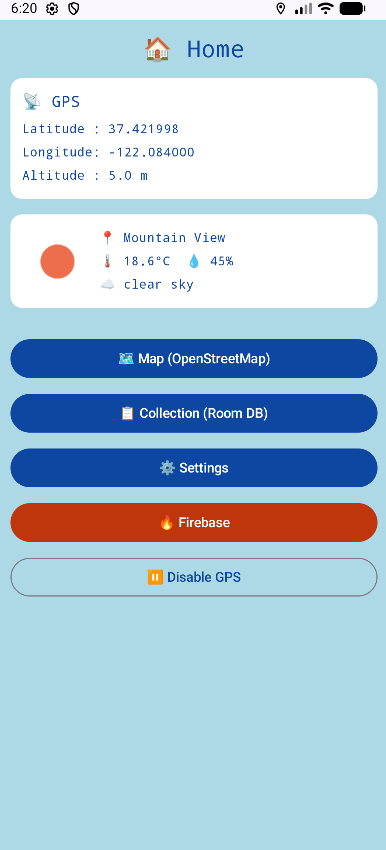
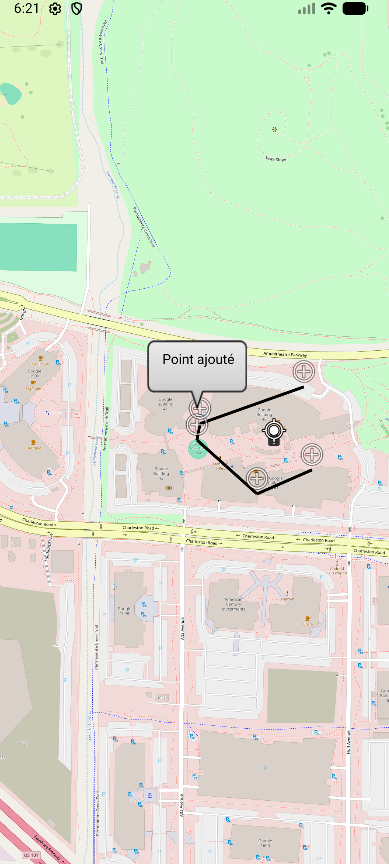
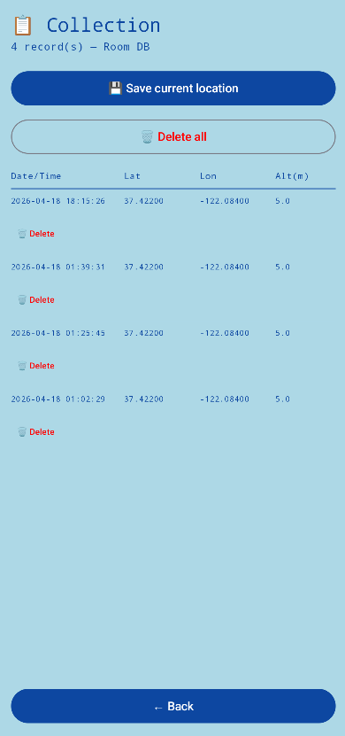
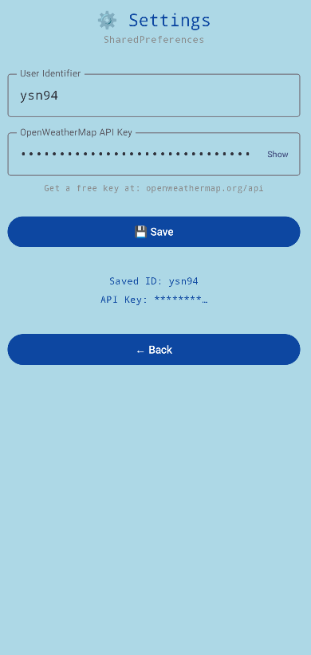
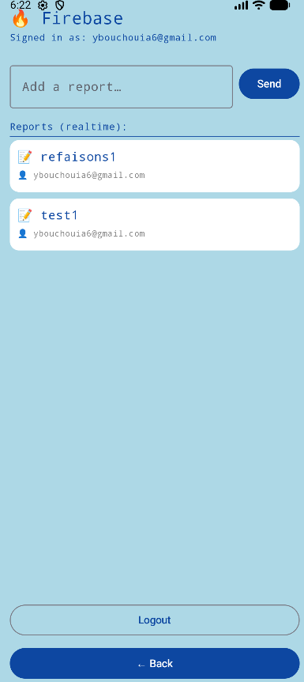

# 🏠 MADProject

## Workspace

**Github:**

* Repository:https://github.com/ysn942/MADProject
* Releases:https://github.com/ysn942/MADProject/releases

Workspace:

\---

## Description

MADProject is an Android application that tracks your GPS location in real time and enriches it with weather data from OpenWeatherMap. It allows users to save, view, and delete location records locally, visualize them on an interactive OpenStreetMap, and share reports through Firebase Realtime Database. Compared to existing apps like Google Maps or Strava, MADTracking focuses on lightweight personal location logging with integrated weather context and cloud reporting — without requiring a complex account setup.

\---

## Screenshots and navigation

|Home Screen|Map (OpenStreetMap)|
|-|-|
|||
|GPS coordinates, weather info, and navigation buttons.|Interactive map with saved locations and added points.|

|Collection (Room DB)|Settings|Firebase|
|-|-|-|
||||
|List of saved GPS coordinates with delete options.|User identifier and API key configuration.|Authenticated user with real-time report list.|

\---

## Demo Video

https://youtu.be/O31jIJKZ-zY

\---

## Features

### Functional features

* Display real-time GPS coordinates (latitude, longitude, altitude)
* Show current weather for the detected location (temperature, humidity, sky condition)
* Save GPS locations to a local Room database
* View and delete saved locations
* Visualize saved locations on an OpenStreetMap
* Add custom points on the map
* Authenticate with Firebase (email or Google)
* Send and view real-time reports via Firebase Realtime Database

### Technical features

* **Persistence – Room database:** stores GPS coordinates locally. [Source code](app/src/main/java/com/example/myapplication/room/)
* **Persistence – SharedPreferences:** saves user identifier and OpenWeatherMap API key. [Source code](app/src/main/java/com/example/myapplication/MainActivity.kt)
* **RESTful API:** OpenWeatherMap (`/data/2.5/find`) via Retrofit. [Source code](app/src/main/java/com/example/myapplication/network/)
* **Maps:** OpenStreetMap via osmdroid. [Source code](app/src/main/java/com/example/myapplication/OpenStreetMapsActivity.kt)
* **Images:** weather icons loaded via Coil (`AsyncImage`)
* **Firebase Authentication:** email/password and Google sign-in via FirebaseUI. [Source code](app/src/main/java/com/example/myapplication/FirebaseActivity.kt)
* **Firebase Realtime Database:** reports pushed to `/hotspots`. [Source code](app/src/main/java/com/example/myapplication/FirebaseActivity.kt)
* **Sensors:** GPS via FusedLocationProviderClient

\---

## How to Use

1. Launch the app and grant GPS permission
2. Home screen shows your coordinates and local weather automatically
3. Tap **Map** to see your position on OpenStreetMap
4. Tap **Collection** to view/delete saved GPS records
5. Tap **Settings** to enter your User ID and OpenWeatherMap API key (free at openweathermap.org/api)
6. Tap **Firebase** to sign in and post/view real-time reports

\---

## Participants

* Name Surname (solal.montalivet@alumnos.upm.es)
* Name Surname (yacine.bouchouia@alumnos.upm.es)

